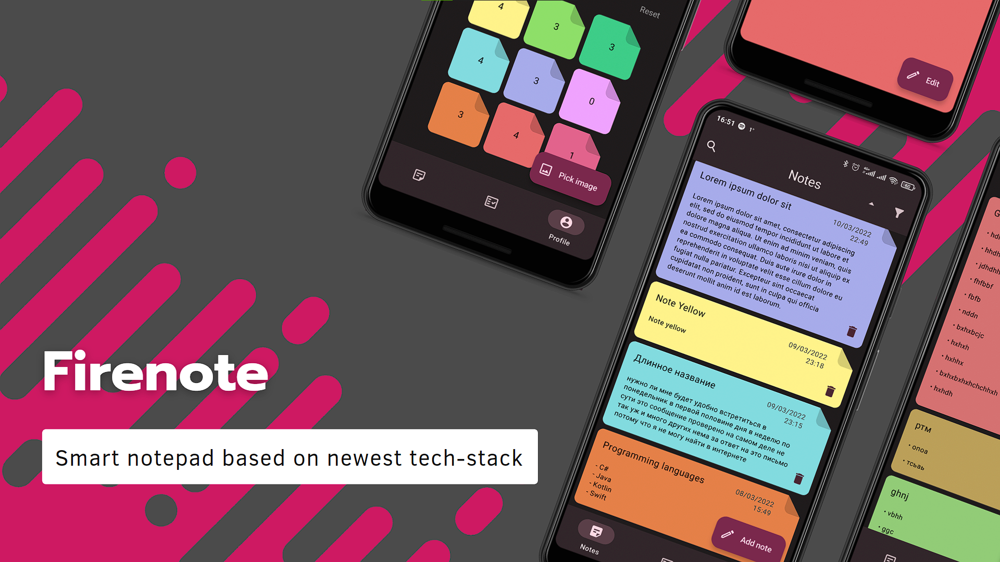

<h1 align="center">Firenote</h1>

<p align="center">
  <a href="https://opensource.org/licenses/Apache-2.0"></a>
  <a href="https://android-arsenal.com/api?level=21"></a>
  <a href="https://github.com/t8rin/Firenote/actions"></a> 
  <a href="https://github.com/t8rin"></a> 
</p>

<p align="center">  
Smart and lightweight notepad, that allows you to manage and create goals, notes with different colors and store them in the cloud
</p>
</br>

<p align="center">

</p>

## Download
Go to the [Releases](https://github.com/t8rin/Firenote/releases) to download the latest APK.


## Tech stack & Open-source libraries
- Minimum SDK level 21

- [Kotlin](https://kotlinlang.org/) based 

- [Coroutines](https://github.com/Kotlin/kotlinx.coroutines) to work with internet and move tasks to a secondary thread

- [Flow](https://kotlin.github.io/kotlinx.coroutines/kotlinx-coroutines-core/kotlinx.coroutines.flow/) to emit values from database directly to compose state

- [Accompanist](https://github.com/google/accompanist) to expand jetpcak compose abilities

- [Firebase](https://github.com/firebase/FirebaseUI-Android) for registering/signing in and storing data in the cloud

- [Hilt](https://dagger.dev/hilt/) for dependency injection.

- JetPack
  - Lifecycle - Observe Android lifecycles and handle UI states upon the lifecycle changes.
  - ViewModel - Manages UI-related data holder and lifecycle aware. Allows data to survive configuration changes such as screen rotations.
  - Compose - Modern Declarative UI style framework.
  
- Architecture
  - MVVM Architecture (View - DataBinding - ViewModel - Model)
  - Repository Pattern

- [Coil](https://github.com/coil-kt/coil) - loading images.

- [Material-Components](https://github.com/material-components/material-components-android) - Material You components with dynamic colors.

# License
```xml
Designed and developed by 2022 T8RIN

Licensed under the Apache License, Version 2.0 (the "License");
you may not use this file except in compliance with the License.
You may obtain a copy of the License at

   http://www.apache.org/licenses/LICENSE-2.0

Unless required by applicable law or agreed to in writing, software
distributed under the License is distributed on an "AS IS" BASIS,
WITHOUT WARRANTIES OR CONDITIONS OF ANY KIND, either express or implied.
See the License for the specific language governing permissions and
limitations under the License.
```
